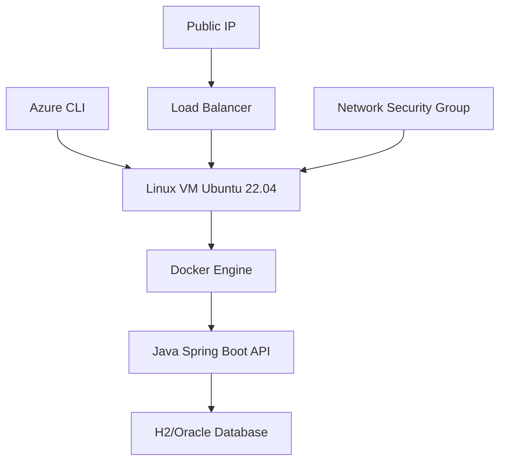

# Mottu Intelligent Parking Management System

## Desenvolvido pela IdeaTec Tecnologia

<div align="center">
  
  
  
  
</div>

---

## 🏢 Sobre a IdeaTec Tecnologia

A **IdeaTec Tecnologia** é uma empresa especializada em soluções de **Cloud Computing**, **DevOps** e **Infraestrutura Escalável**, com foco em transformar desafios operacionais de empresas líderes em oportunidades tecnológicas através de arquiteturas modernas e práticas DevOps avançadas.

### 📊 Projeto Cliente: Mottu

**Cliente:** Mottu - Líder em Mobilidade Urbana
**Projeto:** Sistema de Mapeamento Inteligente de Pátios
**Escopo:** Infraestrutura Cloud e Containerização da API
**Tecnologia:** Azure + Docker + Java Spring Boot

---

## 👨‍💻 Equipe Técnica

| **Nome** | **RM** | **Função** | **Especialidade** |
| :-- | :-- | :-- | :-- |
| **Carlos Eduardo Rodrigues Coelho Pacheco** | RM 557323 |
| **Pedro Augusto Costa Ladeira** | RM 558514 | 
| **João Pedro Amorim Brito Virgens** | RM 559213 | 


---

## 🏗️ Arquitetura da Solução




### **Especificações Técnicas:**

- **Cloud Provider:** Microsoft Azure
- **Compute:** Azure Virtual Machine (Standard_B2s)
- **Operating System:** Ubuntu Server 22.04 LTS
- **Containerization:** Docker CE
- **Application Runtime:** OpenJDK 17
- **Framework:** Spring Boot 3.x
- **Database:** H2 Database Engine
- **Security:** Network Security Groups, non-root containers

---

## 🚀 Stack Tecnológico

| **Categoria** | **Tecnologia** | **Versão** | **Finalidade** |
| :-- | :-- | :-- | :-- |
| **Cloud** | Microsoft Azure | Latest | Infrastructure as a Service |
| **Compute** | Azure Virtual Machine | Ubuntu 22.04 | Application hosting |
| **Containerization** | Docker CE | 24.x | Application packaging |
| **Runtime** | OpenJDK | 17 LTS | Java application execution |
| **Framework** | Spring Boot | 3.x | RESTful API development |
| **Database** | H2 Database | Latest | Data persistence |
| **Security** | Azure NSG | Latest | Network security |
| **Automation** | Azure CLI | 2.73+ | Infrastructure provisioning |


---

## 📋 Pré-requisitos

### **Para Deployment:**

- **Azure CLI** 2.73.0 ou superior
- **Conta Azure** com permissões de criação de recursos
- **SSH Client** para conexão remota
- **Git** para versionamento de código


### **Para Desenvolvimento Local:**

- **Java JDK** 17 ou superior
- **Maven** 3.6+ ou **Gradle** 7+
- **Docker Desktop** (opcional para testes locais)


### **Verificação de Pré-requisitos:**

```bash
# Verificar Azure CLI
az --version

# Verificar autenticação Azure
az account show

# Verificar conectividade
az account list-locations --query "[?name=='eastus']" --output table
```


---

## ⚙️ Instalação e Deployment

### **1. Configuração do Ambiente Azure**

```bash
# Definir variáveis de ambiente
export RESOURCE_GROUP="rg-mottu-production"
export VM_NAME="vm-mottu-api-prod"
export LOCATION="East US"
export NSG_NAME="nsg-mottu-security"
export VM_SIZE="Standard_B2s"
```


### **2. Provisioning da Infraestrutura**

```bash
# Criar Resource Group
az group create \
    --name $RESOURCE_GROUP \
    --location "$LOCATION" \
    --tags Project=Mottu Environment=Production Company=IdeaTec

# Criar Network Security Group
az network nsg create \
    --resource-group $RESOURCE_GROUP \
    --name $NSG_NAME \
    --location "$LOCATION"

# Configurar regras de segurança
az network nsg rule create \
    --resource-group $RESOURCE_GROUP \
    --nsg-name $NSG_NAME \
    --name AllowSSH \
    --protocol tcp \
    --priority 1000 \
    --destination-port-range 22 \
    --access allow \
    --source-address-prefix "*"

az network nsg rule create \
    --resource-group $RESOURCE_GROUP \
    --nsg-name $NSG_NAME \
    --name AllowSpringBootAPI \
    --protocol tcp \
    --priority 1001 \
    --destination-port-range 8080 \
    --access allow \
    --source-address-prefix "*"
```


### **3. Criação da Virtual Machine**

```bash
# Criar VM Linux otimizada
az vm create \
    --resource-group $RESOURCE_GROUP \
    --name $VM_NAME \
    --image Ubuntu2204 \
    --size $VM_SIZE \
    --admin-username azureuser \
    --generate-ssh-keys \
    --nsg $NSG_NAME \
    --public-ip-sku Standard \
    --storage-sku Premium_LRS \
    --tags Project=Mottu Environment=Production

# Obter IP público para conexão
PUBLIC_IP=$(az vm show \
    --resource-group $RESOURCE_GROUP \
    --name $VM_NAME \
    --show-details \
    --query publicIps \
    --output tsv)

echo "✅ VM criada com sucesso - IP: $PUBLIC_IP"
```


---

## 🔧 Configuração do Ambiente de Produção

### **1. Conexão SSH e Configuração Inicial**

```bash
# Conectar à VM via SSH
ssh azureuser@$PUBLIC_IP

# Atualizar sistema operacional
sudo apt update && sudo apt upgrade -y

# Instalar dependências essenciais
sudo apt install -y curl wget git vim htop unzip
```


### **2. Instalação do Docker**

```bash
# Instalar Docker CE
curl -fsSL https://get.docker.com | sh

# Configurar usuário para Docker
sudo usermod -aG docker $USER

# Habilitar Docker como serviço
sudo systemctl enable docker
sudo systemctl start docker

# Reiniciar sessão SSH para aplicar permissões
exit && ssh azureuser@$PUBLIC_IP

# Verificar instalação
docker --version
docker run hello-world
```


### **3. Deploy da Aplicação Mottu**

```bash
# Clonar repositório do projeto
git clone https://github.com/cadupacheco/Sprint-1-Java.git mottu-api
cd mottu-api

# Criar Dockerfile otimizado (se necessário)
cat > Dockerfile << 'EOF'
FROM openjdk:17-jdk-slim

# Criar usuário não-root para segurança
RUN groupadd --gid 1000 mottuuser \
    && useradd --uid 1000 --gid mottuuser --shell /bin/bash --create-home mottuuser

# Definir diretório de trabalho
WORKDIR /app

# Copiar código fonte
COPY . .

# Instalar Maven e fazer build
RUN apt-get update && apt-get install -y maven \
    && mvn clean package -DskipTests \
    && mv target/*.jar mottu-api.jar \
    && apt-get remove -y maven \
    && apt-get autoremove -y \
    && rm -rf /var/lib/apt/lists/* \
    && chown -R mottuuser:mottuuser /app

# Usar usuário não-root
USER mottuuser

# Expor porta da aplicação
EXPOSE 8080

# Variáveis de ambiente para produção
ENV SPRING_PROFILES_ACTIVE=production
ENV JAVA_OPTS="-XX:+UseContainerSupport -XX:MaxRAMPercentage=70.0"

# Health check
HEALTHCHECK --interval=30s --timeout=3s --start-period=5s --retries=3 \
    CMD curl -f http://localhost:8080/actuator/health || exit 1

# Comando de execução
CMD ["sh", "-c", "java $JAVA_OPTS -jar mottu-api.jar"]
EOF

# Build da imagem Docker
docker build -t mottu-api:production .

# Verificar imagem criada
docker images mottu-api:production
```


---

## 🚀 Execução em Produção

### **1. Deploy do Container**

```bash
# Executar aplicação em produção
docker run -d \
    --name mottu-api-container \
    --restart unless-stopped \
    -p 8080:8080 \
    -p 80:8080 \
    -e SPRING_PROFILES_ACTIVE=production \
    -e JAVA_OPTS="-Xmx1g -Xms512m" \
    --health-cmd="curl -f http://localhost:8080/actuator/health || exit 1" \
    --health-interval=30s \
    --health-retries=3 \
    --health-start-period=40s \
    mottu-api:production

# Verificar status do container
docker ps

# Verificar logs de inicialização
docker logs mottu-api-container
```


### **2. Verificações de Segurança**

```bash
# Verificar usuário não-root (requisito de segurança)
docker exec mottu-api-container whoami
docker exec mottu-api-container id

# Verificar processos em execução
docker exec mottu-api-container ps aux

# Verificar configurações de segurança
docker inspect mottu-api-container | grep -i user
```


---

## 🧪 Testes e Validação

### **Testes de Funcionalidade:**

```bash
# Teste de conectividade local
curl -i http://localhost:8080/

# Teste de health check
curl -i http://localhost:8080/actuator/health

# Teste de endpoints da API (adaptar conforme projeto)
curl -X GET http://localhost:8080/api/motos
curl -X POST http://localhost:8080/api/motos \
    -H "Content-Type: application/json" \
    -d '{"modelo": "Mottu Sport 110i", "status": "disponivel"}'
```


### **Testes de Performance:**

```bash
# Verificar uso de recursos
docker stats mottu-api-container --no-stream

# Verificar conectividade de rede
sudo netstat -tlnp | grep -E ":80|:8080"

# Teste de carga básico
for i in {1..100}; do curl -s http://localhost:8080/ > /dev/null; done
```


### **Testes Externos (do ambiente local):**

```bash
# Teste de acesso público
curl -i http://$PUBLIC_IP:8080/

# Teste de latência
ping -c 4 $PUBLIC_IP

# Teste de portas abertas
nmap -p 22,80,8080 $PUBLIC_IP
```


---

## 📊 Monitoramento e Observabilidade

### **Logs e Diagnósticos:**

```bash
# Logs da aplicação em tempo real
docker logs -f mottu-api-container

# Logs dos últimos eventos
docker logs --tail 50 mottu-api-container

# Estatísticas de performance
docker stats mottu-api-container

# Health status
docker inspect mottu-api-container | grep -A 10 Health
```


### **Métricas de Sistema:**

```bash
# Uso de CPU e memória
htop

# Espaço em disco
df -h

# Conexões de rede ativas
ss -tulnp

# Status dos serviços
systemctl status docker
```


---

## 🔒 Segurança e Compliance

### **Medidas de Segurança Implementadas:**

- ✅ **Containers non-root**: Aplicação executa com usuário sem privilégios
- ✅ **Network Security Groups**: Firewall configurado via Azure NSG
- ✅ **Portas controladas**: Apenas portas essenciais abertas (22, 8080)
- ✅ **SSH Key Authentication**: Autenticação por chaves SSH
- ✅ **Container Health Checks**: Monitoramento automático de saúde
- ✅ **Resource Tagging**: Recursos Azure devidamente categorizados
- ✅ **Least Privilege**: Permissões mínimas necessárias


---

## 🗄️ Backup e Disaster Recovery

### **Backup de Dados:**

```bash
# Backup do container (incluindo dados)
docker commit mottu-api-container mottu-api:backup-$(date +%Y%m%d)

# Backup de volumes (se aplicável)
docker run --rm -v mottu_data:/data -v $(pwd):/backup ubuntu tar czf /backup/mottu-backup-$(date +%Y%m%d).tar.gz /data

# Export de imagem para arquivo
docker save mottu-api:production > mottu-api-production.tar
```


### **Procedures de Recovery:**

```bash
# Restaurar de backup
docker load < mottu-api-production.tar

# Restart do serviço
docker stop mottu-api-container
docker rm mottu-api-container
# Re-executar comando de deploy
```


---

## 🧹 Limpeza de Recursos

### **Remoção Segura do Ambiente:**

```bash
# Parar e remover container
docker stop mottu-api-container
docker rm mottu-api-container

# Remover imagens locais
docker rmi mottu-api:production

# Deletar Resource Group (remove toda infraestrutura)
az group delete \
    --name $RESOURCE_GROUP \
    --yes \
    --no-wait

# Verificar remoção
az group show --name $RESOURCE_GROUP --output table || echo "✅ Recursos removidos"
```


---

## 📁 Estrutura do Repositório

```
mottu-intelligent-parking/
├── docs/
│   ├── architecture-diagram.pdf
│   ├── security-assessment.md
│   └── deployment-guide.md
├── src/
│   ├── main/java/com/ideatec/mottu/
│   ├── test/java/com/ideatec/mottu/
│   └── resources/
├── infrastructure/
│   ├── azure-cli-scripts/
│   ├── docker-configs/
│   └── monitoring/
├── .github/
│   └── workflows/
├── Dockerfile
├── docker-compose.yml
├── pom.xml
├── README.md
└── CHANGELOG.md
```


---

## 🛠️ Troubleshooting

### **Problemas Comuns e Soluções:**

| **Problema** | **Causa** | **Solução** |
| :-- | :-- | :-- |
| Container não inicia | Porta ocupada | `docker ps` e liberar porta 8080 |
| Erro de permissão SSH | Chave SSH incorreta | Regenerar chaves: `az vm user update` |
| API não responde | Firewall bloqueando | Verificar NSG rules no Azure |
| Out of memory | JVM mal configurada | Ajustar `JAVA_OPTS` |

### **Comandos de Diagnóstico:**

```bash
# Verificar logs completos
docker logs mottu-api-container --details

# Verificar conectividade de rede
docker exec mottu-api-container netstat -tlnp

# Verificar saúde da aplicação
docker exec mottu-api-container curl localhost:8080/actuator/health

# Verificar recursos disponíveis
docker exec mottu-api-container free -h
```


---


## 📄 Licença e Compliance

Este projeto está licenciado sob os termos do **Contrato de Prestação de Serviços IdeaTec-Mottu**.

**Propriedade Intelectual:** IdeaTec Tecnologia Ltda.
**Cliente:** Mottu Soluções de Mobilidade
**Confidencialidade:** Este código contém informações proprietárias e confidenciais.

---

<div align="center">
  
**Desenvolvido com ⚡ pela IdeaTec Tecnologia**

*Transformando desafios operacionais em soluções tecnológicas escaláveis*

**© 2025 IdeaTec Tecnologia. Todos os direitos reservados.**

</div>
